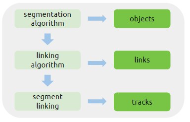

### Introduction

This document contains the working draft of the Tracks specification being developed by the
[Cell Migration Standardisation Organisation (CMSO)](https://cmso.science/).

The current specification is based on the following computational workflow and the data produced therein:

{:class="img-responsive"}

1. A **segmentation algorithm** detects objects of interest (i.e. cells) in a set of microscopy images (usually time-lapse), producing *objects*
2. A **linking algorithm** finds associations between these objects and links them in time, producing *segments*
3. A **segment linking** processes the segments, identifying possible events (gap-closing, split, merge), producing final *tracks*

This specification aims at representing these data in a **tabular format**:

data are held in a *table*. The properties of a table are:

- columns — the list of columns in the table
- rows — the list of rows in the table

For a formal specification of Tabular Data Models see  [Model for Tabular Data and Metadata on the Web-W3C](https://www.w3.org/TR/2015/WD-tabular-data-model-20150108/#model).

### Links

See the [version 0.1](v0.1/index.md) of this specification.
