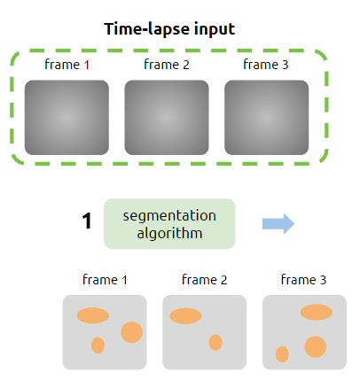

## Definition

This is an example of track specification:

- Object: description
- Segment: description
- Track: description

## Scenarios

### Simple track

{:class="img-responsive"}

Object_ID  |  Frame  |  X |  Y
-----------|---------|----|-----
1          |    1    |    |  
2          |    1    |    |  
3          |    1    |    | 
4          |    2    |    |

