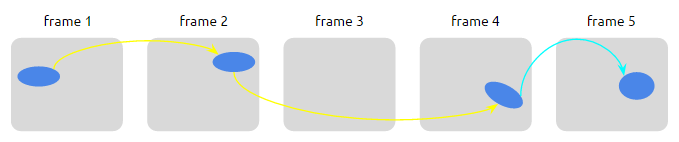
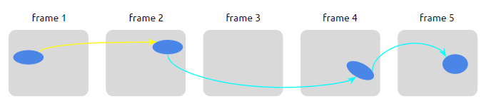
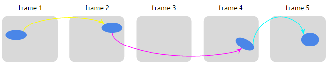
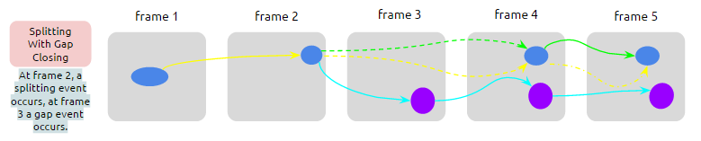
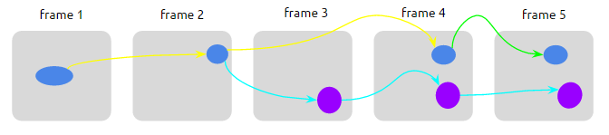
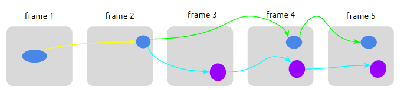
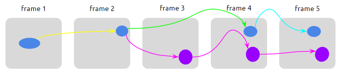

## Definition

This is an example of a track specification:

-   **Object**: an object of interest (such a cell) detected in a microscopy
    image
-   **Link**: a linear, temporal collection of objects
-   **Track**: a collection of links

## Scenarios

### A simple track

The following shows an input consisting of 3 images.

The case illustrated shows 3 objects identified in each frame. At this stage,
there is no associations between objects across the frames.

{:class="img-responsive"}

The **objects table** is:

Object_ID  |  Frame  |  X |  Y
-----------|---------|----|-----
1          |    1    |    |  
2          |    1    |    |  
3          |    1    |    |
4          |    2    |    |
5          |    2    |    |
6          |    2    |    |
7          |    3    |    |
8          |    3    |    |
9          |    3    |    |

With a linking algorithm, an association is created between objects across
frames, and links are produced. The colored lines in the next figure represent
these links.

{:class="img-responsive"}

The **links table** is:

  Link_ID  |  Object_ID
-----------|------------
 1         |    1
 1         |    4
 1         |    7
 2         |    2
 2         |    5
 2         |    8
 3         |    3
 3         |    6
 3         |    9

In this table, the foreign key to the objects table is the **Object_ID**.
This specification requires unique **Object_ID** in the objects table. If this
is not the case, an extra **frame** column `MUST` be present in the links
table.

Finally, tracks are derived from objects + links information:
{:class="img-responsive"}

In this simple case, the **tracks table** would look like this:

Track_ID |  Link_ID
---------|------------
 1       |    1
 2       |    2
 3       |    3

### Gap-closing

A gap event occurs when an object of interest (a cell) disappear for
one frame and then reappears a bit further (next frame or more).

This case can be illustrated as follows:

{:class="img-responsive"}

The detected object is lost at frame 3, and then reappears at frame 4.

The **objects table** is:

Object_ID  |  Frame  |  X |  Y
-----------|---------|----|-----
1          |    1    |    |  
2          |    2    |    |  
3          |    4    |    |
4          |    5    |    |

In this specification, the gap-closing event is explicitly represented in the
repetition of the **Object_ID** reference. Therefore, the **links table** can
take one of the three following forms:

- **A**

Link_ID |  Object_ID
-----------|------------
 1         |    1
 1         |    2
 1         |    3
 2         |    3
 2         |    4

Here, the **Object_ID** repeated is the one after the gap event, and the
**tracks table** is:

  Track_ID |  Link_ID
  ---------|------------
   1       |    1
   1       |    2

This case can be illustrated as follows:

{:class="img-responsive"}

- **B**

Link_ID |  Object_ID
-----------|------------
 1         |    1
 1         |    2
 2         |    2
 2         |    3
 2         |    4

Here, the **Object_ID** repeated is the one before the gap event, and the
**tracks table** is:

Track_ID |  Link_ID
---------|------------
 1       |    1
 1       |    2

This case can be illustrated as follows:

{:class="img-responsive"}

- **C**

Link_ID |  Object_ID
-----------|------------
 1         |    1
 1         |    2
 2         |    3
 2         |    4
 3         |    2
 3         |    3

Here, both the **Object_ID** reference of the objects before and after the
event are repeated, and the corresponding **tracks table** is:

 Track_ID |  Link_ID
 ---------|------------
  1       |    1
  1       |    2
  1       |    3

This case can be illustrated as follows:

{:class="img-responsive"}

### Split/merge events

-   Split event: when a detected object seems to divide in two objects in the
    next frame.
-   Merge event: when two detected objects seem to collide into one object.

#### A split event
A split event looks like this:

{:class="img-responsive"}

The **objects table** in this case is:

Object_ID  |  Frame  |  X |  Y
-----------|---------|----|-----
1          |    1    |    |  
2          |    2    |    |  
3          |    3    |    |
4          |    3    |    |
5          |    4    |    |
6          |    4    |    |
7          |    5    |    |
8          |    5    |    |

The **links table** is:

Link_ID |  Object_ID
-----------|------------
 1         |    1
 1         |    2
 1         |    3
 1         |    5
 1         |    7
 2         |    2
 2         |    4
 2         |    6
 2         |    8

In this case, the split event is encoded in the repetition of the
**Object_ID** reference: Object_ID = 2 is in Link_ID = 1 and Link_ID = 2
(1:n relationship from objects to links).

The corresponding **tracks table** is:

 Track_ID |  Link_ID
 ---------|------------
  1       |    1
  1       |    2
  2       |    2
  3       |    1

Links 1 and 2 are assigned to the same track, track 1.

#### A merge event
A merge event looks like this:

{:class="img-responsive"}

The **objects table** in this case is:

Object_ID  |  Frame  |  X |  Y
-----------|---------|----|-----
1          |    1    |    |  
2          |    2    |    |  
3          |    3    |    |
4          |    3    |    |
5          |    4    |    |
6          |    4    |    |
7          |    5    |    |

The **links table** is:

Link_ID |  Object_ID
-----------|------------
 1         |    1
 1         |    3
 1         |    5
 2         |    2
 2         |    4
 2         |    5
 2         |    6
 2         |    7

Again, the merge event is encoded in the repetition of the **Object_ID**
reference: Object_ID = 5 is in Link_ID = 1 and Link_ID = 2 (1:n
relationship from objects to links).

The corresponding **tracks table** is:

 Track_ID |  Link_ID
 ---------|------------
  1       |    1
  2       |    2
  2       |    1
  3       |    2

Links 1 and 2 are assigned to the same track, track 2.

### Combination of events
#### A split event with a gap-closing

A split event in combination with a gap-closing event looks like this:
{:class="img-responsive"}

The **objects table** in this case is:

Object_ID  |  Frame  |  X |  Y
-----------|---------|----|-----
1          |    1    |    |  
2          |    2    |    |  
4          |    3    |    |
5          |    4    |    |
6          |    4    |    |
7          |    5    |    |
8          |    5    |    |

The **links table** can take one of the following forms:

- **A**

Link_ID    |  Object_ID
-----------|------------
 1         |    1
 1         |    2
 1         |    5
 3         |    5
 3         |    7
 2         |    2
 2         |    4
 2         |    6
 2         |    8

{:class="img-responsive"}

- **B**

Link_ID    |  Object_ID
-----------|------------
 1         |    1
 1         |    2
 3         |    2
 3         |    5
 3         |    7
 2         |    2
 2         |    4
 2         |    6
 2         |    8

{:class="img-responsive"}

 - **C**

 Link_ID   |  Object_ID
-----------|------------
 1         |    1
 1         |    2
 3	       |    2
 3         |    5
 2         |    5
 2         |    7
 4         |    2
 4	       |    4
 4	       |    6
 4	       |    8

{:class="img-responsive"}

### Links
See the data package representation of this specification.
