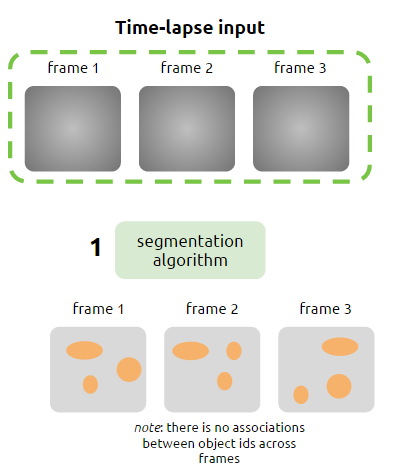
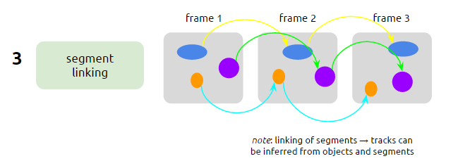
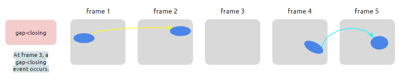
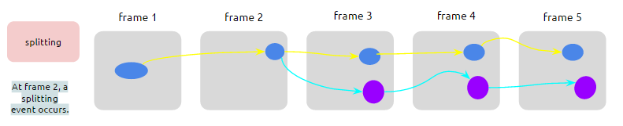
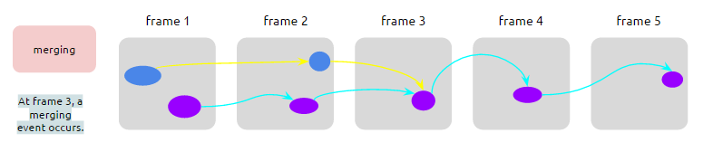

## Definition

This is an example of a track specification:

- **Object**: an object of interest (such a cell) detected in a microscopy image
- **Segment**: a linear, temporal collection of objects
- **Track**: a collection of segments

## Scenarios

### A simple track

The following shows an input consisting of 3 images.

The case illustrated shows 3 objects identified in each frame. At this stage, there is no associations between objects across the frames.

{:class="img-responsive"}

The **objects table** is:

Object_ID  |  Frame  |  X |  Y
-----------|---------|----|-----
1          |    1    |    |  
2          |    1    |    |  
3          |    1    |    |
4          |    2    |    |
5          |    2    |    |
6          |    2    |    |
7          |    3    |    |
8          |    3    |    |
9          |    3    |    |

With a linking algorithm, an association is created between objects across frames, and segments are produced. The colored lines in the next figure represent these segments.

{:class="img-responsive"}

The **segments table** is:

Segment_ID |  Object_ID
-----------|------------
 1         |    1
 1         |    4
 1         |    7
 2         |    2
 2         |    5
 2         |    8
 3         |    3
 3         |    6
 3         |    9

In this table, the foreign key to the segments table is the **Object_ID**. This specification requires unique **Object_ID** in the objects table. If this is not the case, an extra **frame** column is necessary in the segments table.

Finally, tracks are derived from objects + segments information:
{:class="img-responsive"}

In this simple case, the **tracks table** would look like this:

Track_ID |  Segment_ID
---------|------------
 1       |    1
 2       |    2
 3       |    3

### Gap-closing

A gap closing event occurs when an object of interest (a cell) disappear for one frame and then reappears a bit further (next frame or more).

This case can be illustrated as follows:

{:class="img-responsive"}

The detected object is lost at frame 3, and then reappears at frame 4.
In this case, the linking algorithm will create two segments (the yellow and the blue lines in the image).

The **objects table** is:

Object_ID  |  Frame  |  X |  Y
-----------|---------|----|-----
1          |    1    |    |  
2          |    2    |    |  
3          |    4    |    |
4          |    5    |    |

The **segments table** is:

Segment_ID |  Object_ID
-----------|------------
 1         |    1
 1         |    2
 2         |    3
 2         |    4

 and the corresponding **tracks table**:

 Track_ID |  Segment_ID
 ---------|------------
  1       |    1
  1       |    2

So, basically, the two segments are joined in one track.

### Split/merge events
- Split event: when a detected object seems to divide in two objects in the next frame.
- Merge event: when two detected objects seem to collide into one object.

#### A split event
A split event looks like this:

{:class="img-responsive"}

The **objects table** in this case is:

Object_ID  |  Frame  |  X |  Y
-----------|---------|----|-----
1          |    1    |    |  
2          |    2    |    |  
3          |    3    |    |
4          |    3    |    |
5          |    4    |    |
6          |    4    |    |
7          |    5    |    |
8          |    5    |    |

The **segments table** is:

Segment_ID |  Object_ID
-----------|------------
 1         |    1
 1         |    2
 1         |    3
 1         |    5
 1         |    7
 2         |    2
 2         |    4
 2         |    6
 2         |    8

In this case, the split event is encoded in the repetition of the **Object_ID** reference: Object_ID = 2 is in Segment_ID = 1 and Segment_ID = 2 (1:n relationship from objects to segments).

The corresponding **tracks table** is:

 Track_ID |  Segment_ID
 ---------|------------
  1       |    1
  1       |    2
  2       |    2
  3       |    1

Segments 1 and 2 are assigned to the same track, track 1.

#### A merge event
A merge event looks like this:

{:class="img-responsive"}

The **objects table** in this case is:

Object_ID  |  Frame  |  X |  Y
-----------|---------|----|-----
1          |    1    |    |  
2          |    2    |    |  
3          |    3    |    |
4          |    3    |    |
5          |    4    |    |
6          |    4    |    |
7          |    5    |    |

The **segments table** is:

Segment_ID |  Object_ID
-----------|------------
 1         |    1
 1         |    3
 1         |    5
 2         |    2
 2         |    4
 2         |    5
 2         |    6
 2         |    7

Again, the merge event is encoded in the repetition of the **Object_ID** reference: Object_ID = 5 is in Segment_ID = 1 and Segment_ID = 2 (1:n relationship from objects to segments).

The corresponding **tracks table** is:

 Track_ID |  Segment_ID
 ---------|------------
  1       |    1
  2       |    2
  2       |    1
  3       |    2

Segments 1 and 2 are assigned to the same track, track 2.

### Links
See the data package representation of this specification.
